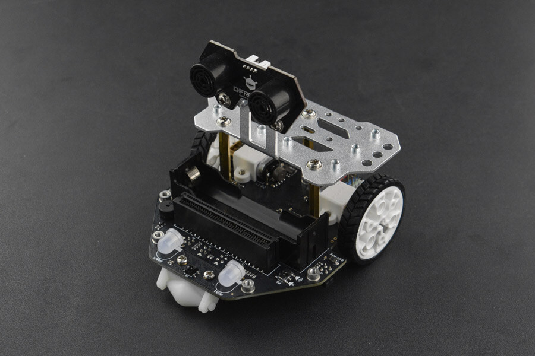

# DFRobot_MaqueenPlus


Maqueen plus is a STEM educational robot . Optimized with better power management and larger capacity power supply, it can be perfectly compatible with Huskylens AI Vision Sensor.
   
   

## Product Link (https://www.dfrobot.com/product-2026.html)
    SKU: MBT0021-EN

## Table of Contents

  * [Summary](#summary)
  * [Installation](#installation)
  * [Methods](#methods)
  * [Compatibility](#compatibility)
  * [History](#history)
  * [Credits](#credits)

## Summary

The library contains use basic examples for Maqueen Plus like IR, line-tracking sensors, RGB lights, ultrasonic, and servo.

## Installation

To use this library, first download the library file, paste it into the \Arduino\libraries directory, then open the examples folder and run the demo in the folder.

## Methods

```C++
 /**
  * @fn begin
  * @brief Init I2C until success 
  * @return uint8_t type, indicate returning init status
  * @retval 0 Init succeeded
  * @retval -1 Init failed
  */
  uint8_t begin(void);

 /**
  * @fn PIDSwitch
  * @brief PID operation control
  * @param state To disable or enable PID
  * @return None
  */
  void PIDSwitch(ePID state);

 /**
  * @fn motorControl
  * @brief Control the direction and speed of MaqueenPlus
  * @param motor Motor control selection
  * @param direction Motor rotation direction 
  * @param speed Motor speed(range:0~255)
  * @return None
  */
  void motorControl(ePosition motor, eDir direction, uint8_t speed);

 /**
  * @fn getSpeed
  * @brief Get wheel speed
  * @param motor Select left or right motor
  * @return Return the speed of the selected motor 
  */
  uint8_t getSpeed(ePosition motor);

 /**
  * @fn getDirection
  * @brief Get rotation direction
  * @param motor Select left or right motor 
  * @return  0: stop 1: forward 2: backward
  */
  uint8_t getDirection(ePosition motor);

 /**
  * @fn getDistance
  * @brief  Get the number of revolutions
  * @param motor Select left or right motor
  * @return Return the revolutions
  */
  float getDistance(ePosition motor);

 /**
  * @fn clearDistance
  * @brief Clear the number of revolutions
  * @param motor Select left or right motor
  * @return None
  */
  void clearDistance(ePosition motor);

 /**
  * @fn getPatrol
  * @brief  Get line-tracking sensor status
  * @param senser Select line-tracking sensor 
  * @return Returns the status of line-tracking sensor
  */
  uint8_t getPatrol(ePatrol senser);

 /**
  * @fn getGrayscale
  * @brief Get grayscale value of line-tracking sensor
  * @param senser Select line-tracking sensor 
  * @return  Return the grayscale value of line-tracking sensor
  */
  uint16_t getGrayscale(ePatrol senser);

 /**
  * @fn setRGB
  * @brief Set the RGB led color
  * @param colour Select Color
  * @return None
  */
  void setRGB(ePosition light,eColor color);

 /**
  * @fn servoControl
  * @brief Servo control
  * @param servo Select servo
  * @param angle Control servo angle(range:0°~180°)
  * @return None
  */
  void servoControl(eServo servo, uint8_t angle);

/**
 * @fn ultraSonic
 * @brief Get ultrasonic distance
 * @param trig   TRIG Pin
 * @param echo   ECHO Pin
 * @return  Return ultrasonic distance information
 */
  uint8_t ultraSonic(ePin trig, ePin echo);

 /**
  * @fn getIR
  * @brief Get infrared data
  * @return  Return infrared key information
  */
 uint32_t getIR(void);

 /**
  * @fn getVersion
  * @brief  Get version information
  * @return  Return version information
  */
  String getVersion(void); 
```

## Compatibility

MCU                | Work Well    | Work Wrong   | Untested    | Remarks |
------------------ | :----------: | :----------: | :---------: | :-----: |
micro:bit          |      √       |              |             |         |

## History

- 2020/09/15 - 1.0.0 Version
- 2021/09/27 - 1.0.1 Version

## Credits

Written by TangJie(jie.tang@dfrobot.com), 2020. (Welcome to our [website](https://www.dfrobot.com/))
